# README

使用Python进行的DSP运算，运行的结果如下图所示。

[TOC]

## 2.2

## 2.2](image/2.2.png)

## 2.4

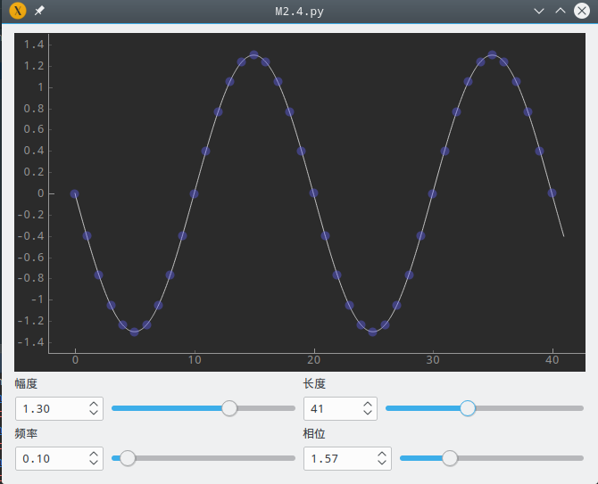

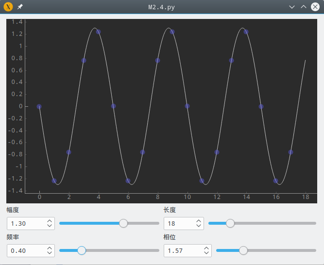

## 2.6

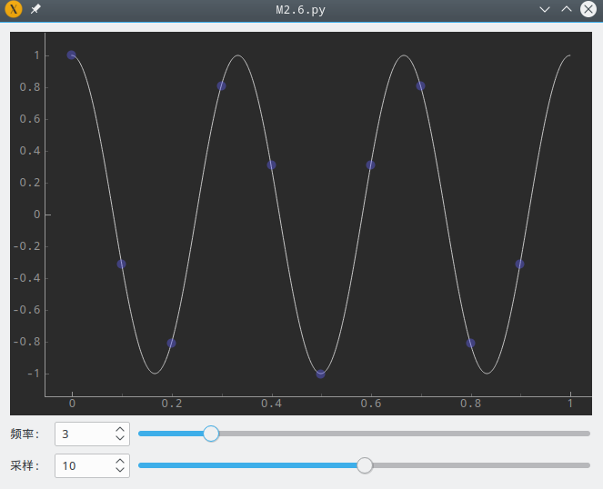

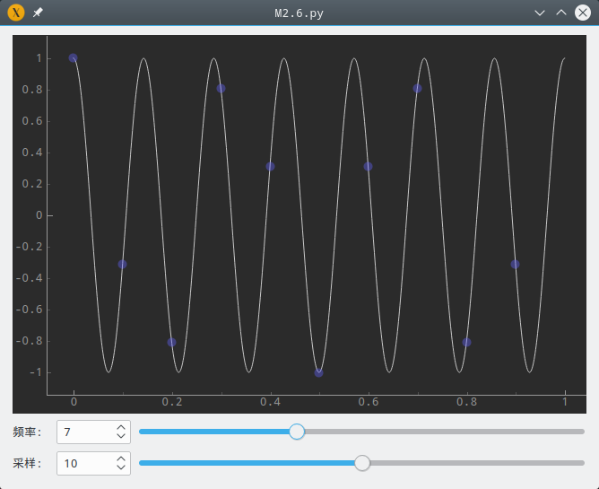

## 3.2

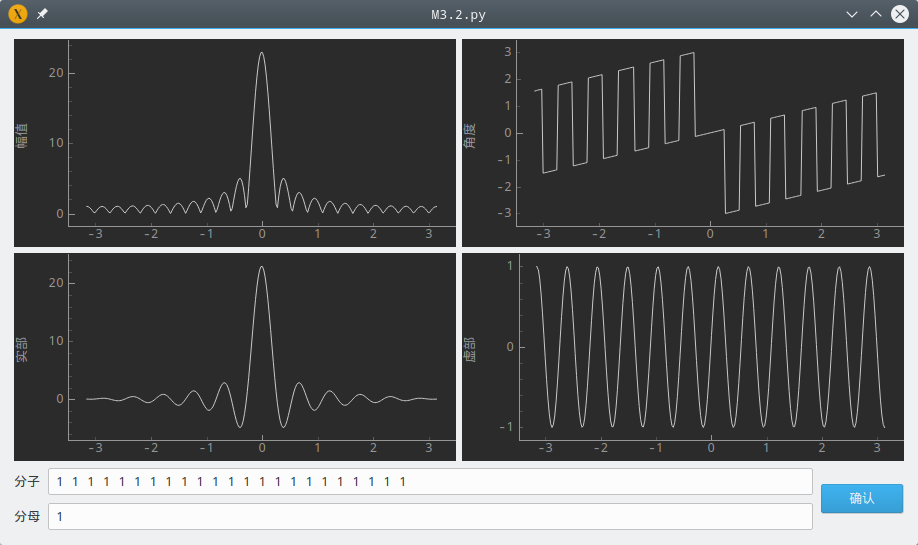

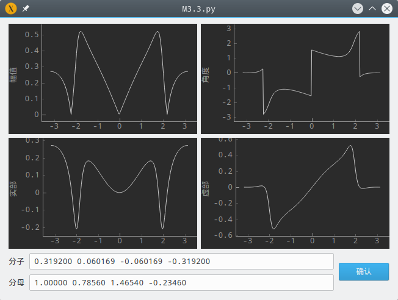

## 3.3

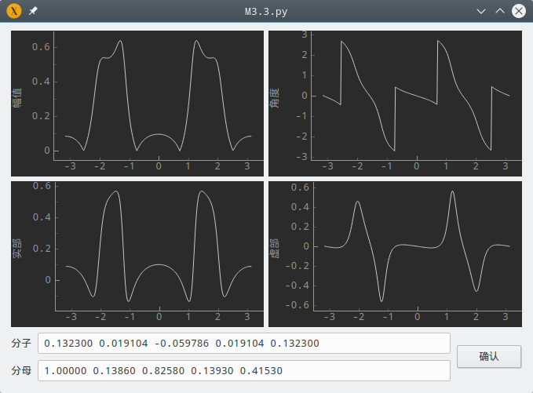

## 3.4

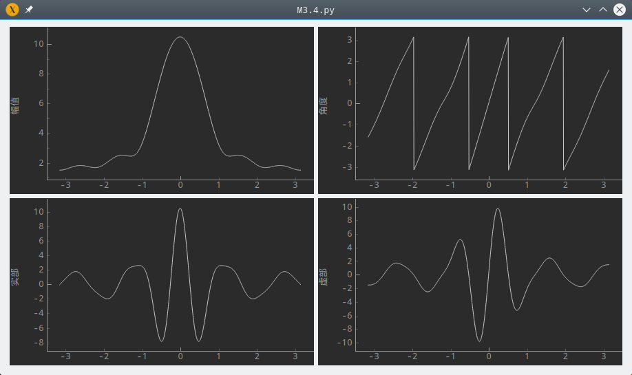

## 4.1

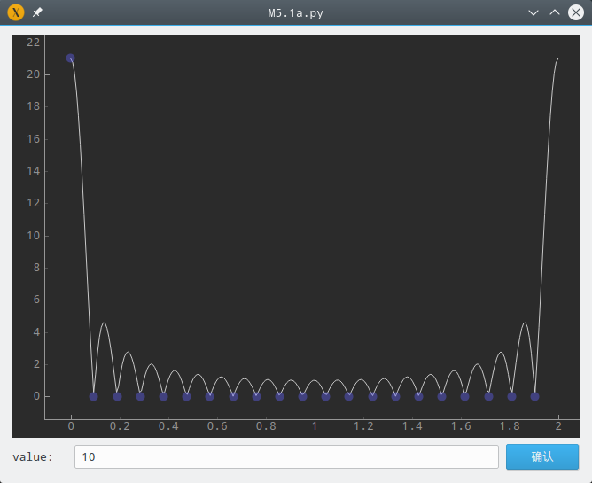

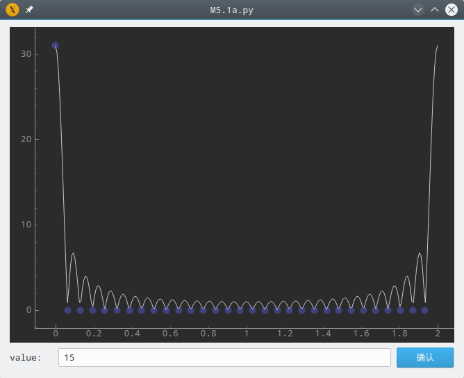

## 5.1.b

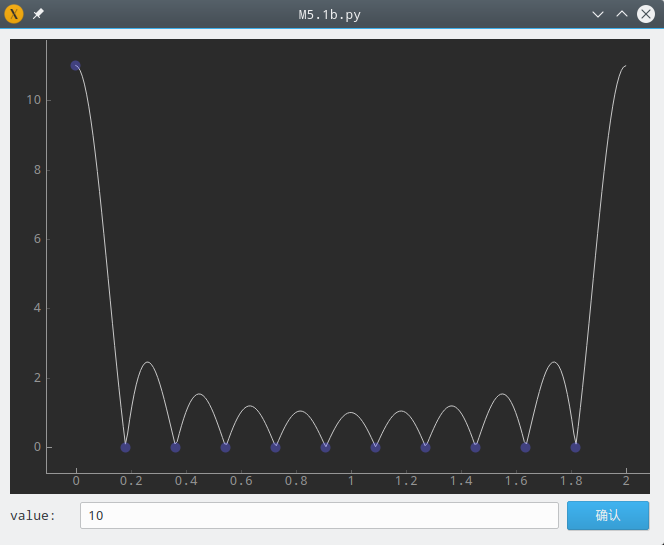

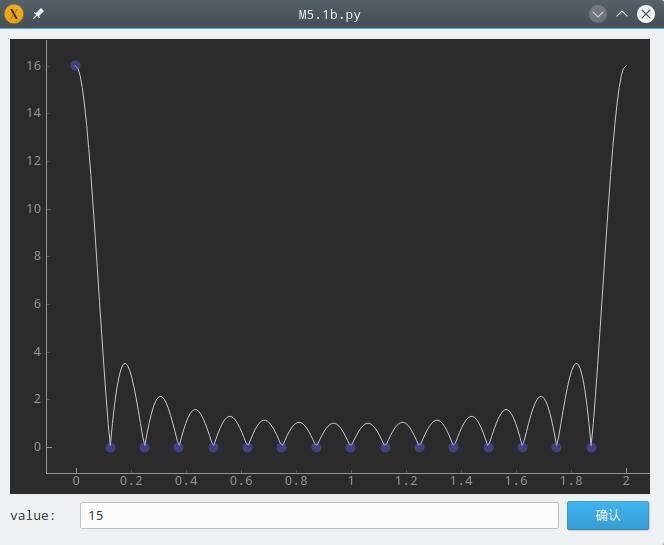

## 5.1.c

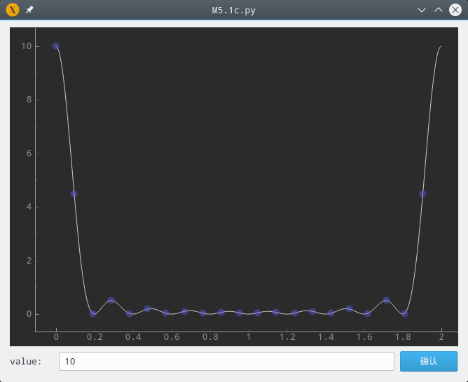

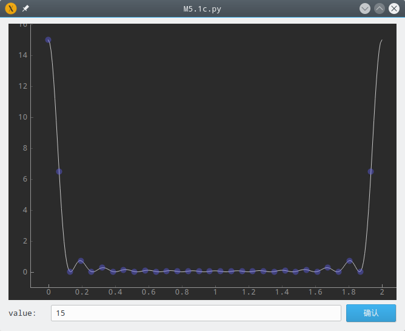

## 5.1.d

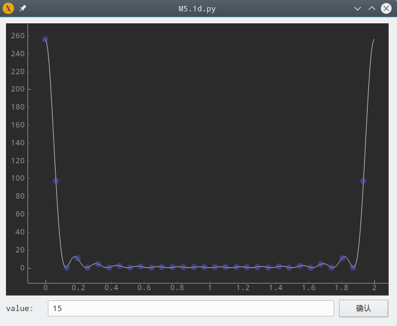

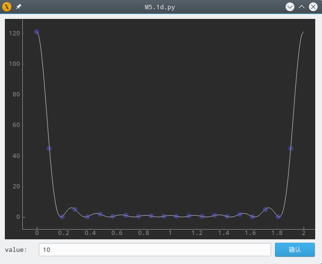

## 5.1.e

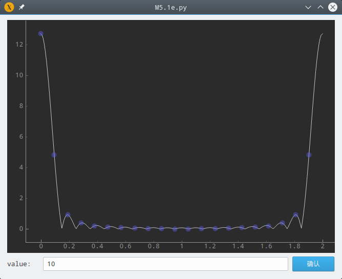

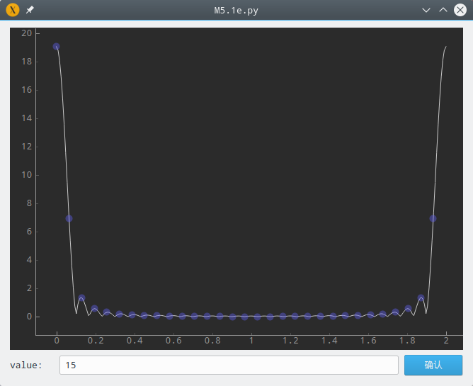

## 6.1

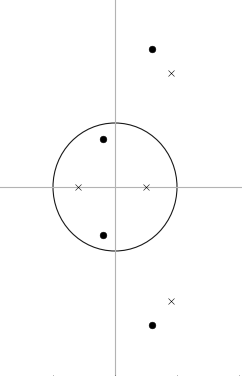

## 9.1

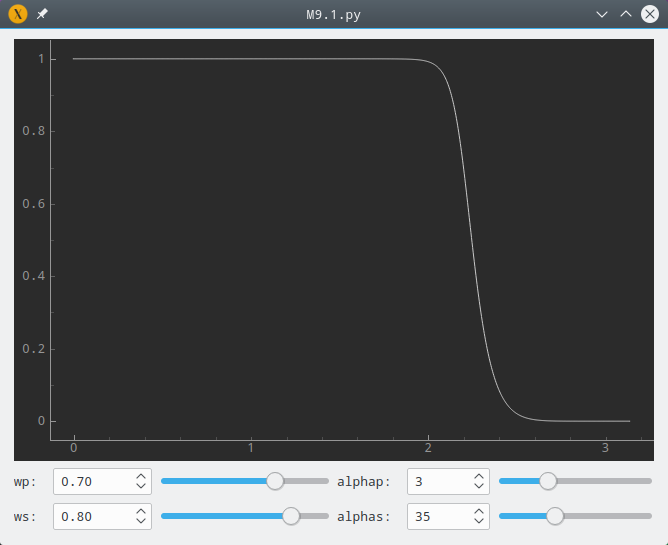

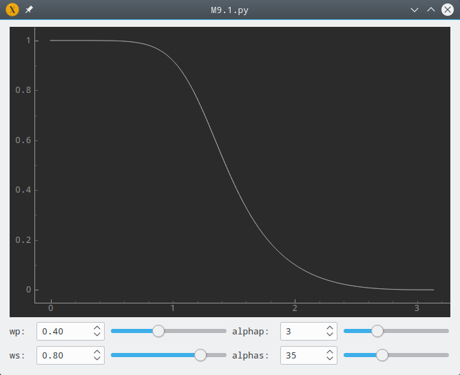

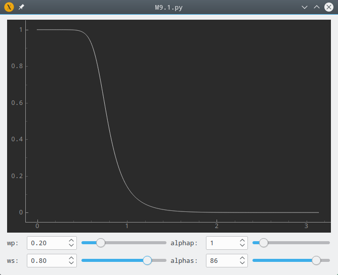

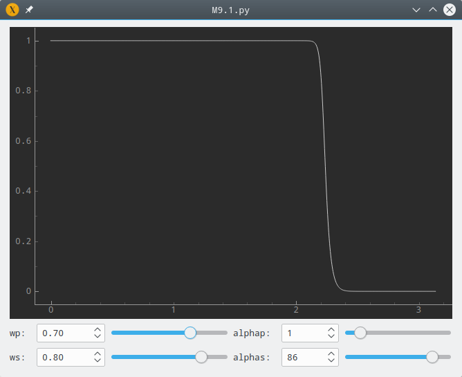

## 11.1

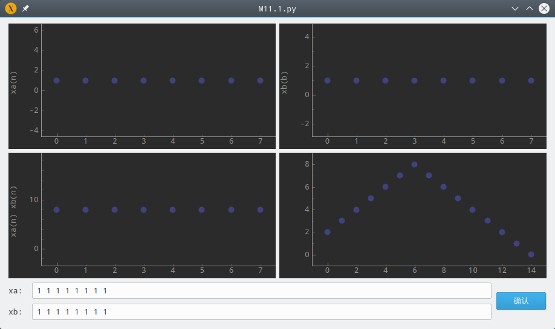

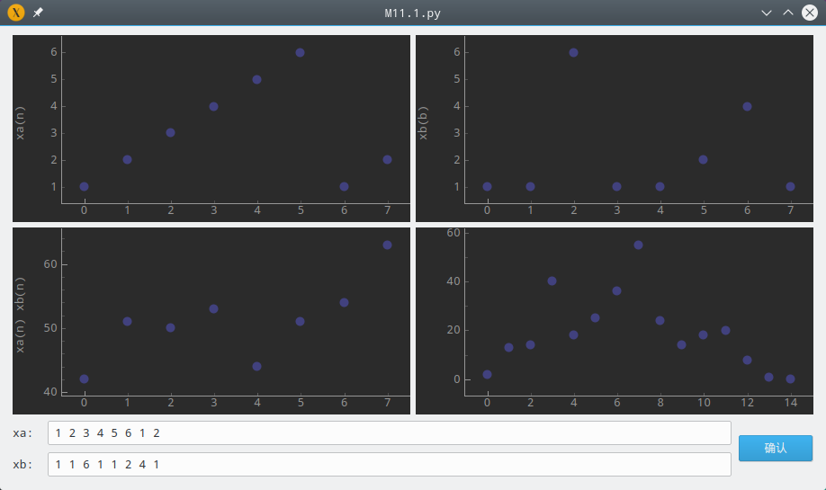

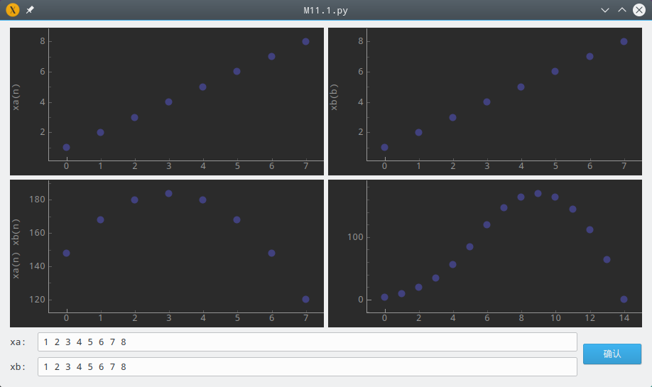

